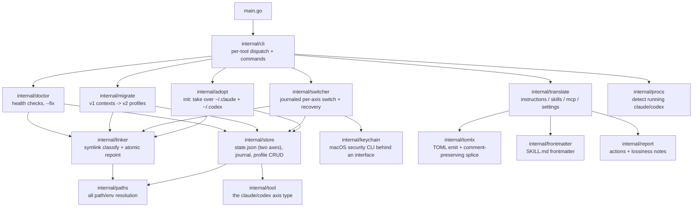

# claudectx

[](https://github.com/tlrmchlsmth/claudectx/actions/workflows/ci.yml)

**kubectx for your AI coding agents.** Keep independent, named *profiles* for
Claude Code and Codex CLI — settings, auth tokens, skills, instructions, MCP
servers — and switch each tool on its own axis. Translate configuration
between the two tools.

Why per-tool? Identities don't pair up. You might have three Claudes (work
via Vertex, personal Max plan, a work API key) and two Codexes (personal,
work API key). Each tool switches independently:

```console
$ claudectx create claude vertex
$ claudectx claude vertex
Switched claude to "vertex" (keychain ✓)
$ claudectx codex work          # codex switches without touching claude
Switched codex to "work"
$ claudectx
claude: vertex
codex:  work
$ claudectx claude -            # per-tool previous
```

## Install

```sh
go install github.com/tlrmchlsmth/claudectx@latest   # or: just install
```

Then adopt your existing state:

```sh
claudectx init
```

`init` moves `~/.claude` and `~/.codex` into per-tool `default` profiles
under `~/.claudectx/profiles/` and symlinks them back. Nothing is deleted;
`~/.claude.json` is backed up to `~/.claudectx/backups/` first. If either
path is already a symlink you manage yourself (e.g. into dotfiles),
claudectx refuses to touch it and tells you why.

## Terminal-scoped profiles

Global switching changes every terminal at once (it's a symlink). To pin
just **one terminal's tool** to a profile, use env pinning — both tools
natively honor `CLAUDE_CONFIG_DIR` / `CODEX_HOME`:

```sh
eval "$(claudectx env codex work)"   # this terminal's codex now uses "work"
claudectx shell --claude vertex --codex work   # or: a pinned subshell
eval "$(claudectx env --unset)"      # follow the global profiles again
```

Add `eval "$(claudectx shell-init)"` to your shell rc for the short form:

```sh
cx claude work    # pin this terminal's claude
cx codex personal # pin this terminal's codex
cx off            # unpin both
cx                # status
```

`claudectx current` and the status view are pin-aware. One caveat: the macOS
Keychain is per-user, not per-terminal, so pinned terminals share whichever
Claude login is globally active — pinning isolates settings, skills, MCP
servers, and history, not the OAuth token. (Codex `auth.json` *is*
per-profile even when pinned.) Avoid running global switches while a pinned
terminal actively uses the same profile — both write the same `.claude.json`.

## Tab completion

`claudectx completion <bash|zsh|fish>` prints a completion script that
completes subcommands, tool names, flags, and live profile names:

```sh
# bash (~/.bashrc) or zsh (~/.zshrc, after compinit):
eval "$(claudectx completion bash)"
eval "$(claudectx completion zsh)"

# fish:
claudectx completion fish > ~/.config/fish/completions/claudectx.fish
```

The zsh script also works as a static file: save it as `_claudectx`
anywhere in your `$fpath`.

## How it works

```
~/.claude  -> ~/.claudectx/profiles/claude/<current>/home   (symlink)
~/.codex   -> ~/.claudectx/profiles/codex/<current>/home    (symlink)
~/.claude.json <- copy-swapped on claude switches with the profile's
                  home/.claude.json (not symlinked: Claude Code rewrites it
                  with rename(2), which would destroy a symlink)
```

Each axis has its own current/previous in `~/.claudectx/state.json`. The
profile's claude.json copy lives at `profiles/claude/<name>/home/.claude.json`
— exactly where Claude Code itself writes it under `CLAUDE_CONFIG_DIR`, so
global mode and terminal pinning share one canonical file.

A **claude** switch runs five journaled steps (stash keychain → capture
claude.json → repoint link → install claude.json → restore keychain). A
**codex** switch is a single atomic link repoint — `auth.json` lives inside
the dir and travels by itself.

### Crash recovery

Every multi-step operation writes a journal entry to
`~/.claudectx/state.json` before each step. If a switch or migration dies
halfway — power loss, ^C, a failing `security` call — the **next claudectx
command of any kind** notices the journal and rolls the operation *forward*
to its target before doing anything else. Steps are ordered so this is
always safe: outgoing state is captured before anything moves, the symlink
repoint is the atomic commit point, and the installing steps are pure
replays. Recovery reconciles by looking at where the links actually point,
not by trusting what the journal says happened, so even a crash *during
recovery* converges. `claudectx doctor` shows any pending journal.

### Tokens

Each profile carries its own logins:

- **Codex**: `auth.json` (a ChatGPT login *or* your `OPENAI_API_KEY`) lives
  inside the symlinked dir — travels with the profile automatically. Use
  `codex login --with-api-key` so the key lands on disk; a key set only via
  the `OPENAI_API_KEY` shell variable is not profile-scoped.
- **Claude Code (macOS)**: the OAuth token lives in the Keychain. On switch,
  claudectx stashes it into the outgoing profile
  (`profiles/claude/<name>/secrets/`, mode 0600) and restores the incoming
  profile's token. A profile with no stored login gets the keychain item
  *deleted*, so tokens never leak between profiles; just run `claude` and
  log in once.
- **Claude Code (Linux)**: `~/.claude/.credentials.json` travels with the dir.
- **Claude via Vertex or an Anthropic API key**: configure the `env` block
  of the profile's `settings.json` (`CLAUDE_CODE_USE_VERTEX`,
  `ANTHROPIC_API_KEY`, …) — it's a file in the profile, so it travels.

Disable keychain handling with `CLAUDECTX_NO_KEYCHAIN=1`.
No credential — the Keychain stash, Claude's `.credentials.json`, or Codex's
`auth.json` — is ever copied by `create --from`; clones start logged out so
each profile holds its own key. Tokens are also never printed and never
passed as command-line arguments.

## Commands

| Command | What it does |
|---|---|
| `claudectx` | status: both tools' current profiles |
| `claudectx claude <name>` / `claudectx codex <name>` | switch that tool (`--force` skips the running-process check) |
| `claudectx claude -` / `claudectx codex -` | that tool's previous profile |
| `claudectx claude` / `claudectx codex` | list that tool's profiles |
| `claudectx list [--json]` | both tools' profiles |
| `claudectx current [claude\|codex]` | both currents, or one bare name (scriptable) |
| `claudectx show <tool> [name] [--json]` | settings, skills, MCP servers, token presence |
| `claudectx create <tool> <name> [--from [<p>]]` | new empty profile; `--from` clones one (never its credentials) |
| `claudectx delete <tool> <name>` | confirm, then move to `backups/` (never `rm -rf`) |
| `claudectx rename <tool> <old> <new> [--force]` | rename (relinks if active) |
| `eval "$(claudectx env <tool> <name>)"` / `claudectx shell …` | pin one terminal |
| `claudectx inject <tool> [name] <target>` | copy a profile into a container (below) |
| `claudectx translate <direction>` | convert config between the tools (below) |
| `claudectx migrate` | upgrade a v1 paired-context install (below) |
| `claudectx doctor [--fix]` | verify symlinks, perms, state consistency |
| `claudectx completion <bash\|zsh\|fish>` | print a tab-completion script |

## Containers

`inject` lands a profile in a container's config dir, so the tool inside
just works — no env vars needed:

```sh
claudectx inject claude pod/vllm-decode-0 -n dev    # k8s (via kubectl exec)
claudectx inject claude work docker:a1b2c3          # docker / podman:NAME
claudectx inject codex dir:./cfg                    # local dir, for mounts
```

What travels: settings, skills, agents, `CLAUDE.md`/`AGENTS.md`, MCP config
(`.claude.json` with the per-host `projects` key stripped). What doesn't:
transcript history, todos, caches, logs — host-private noise that is most
of the bytes. The snapshot is one-way; nothing syncs back. The target needs
`sh` and `tar` (same as `kubectl cp`). Re-running `inject` refreshes.

Credentials are opt-in (`--with-creds`) and travel only inside the exec
stream — never argv, never a file at rest. For Claude OAuth logins, only
the short-lived **access token** is sent (translated to the
`.credentials.json` form Linux expects): claude in the container works
until the token expires, then asks to log in; re-run `inject` to refresh.
The long-lived refresh token stays in your keychain, so anyone who can
`kubectl exec` into the pod can only steal a token that dies on its own in
hours. `--with-refresh-token` opts out for long-lived personal containers.

For durable in-cluster use, prefer credentials that don't expire or rot: a
Vertex profile (auth is plain `settings.json` env — with GKE Workload
Identity the pod holds no secret material at all) or an API-key profile.
Those inject as pure config, once per pod. Design notes:
[docs/design/inject.md](docs/design/inject.md).

## Translation

```sh
claudectx translate claude-to-codex --dry-run
claudectx translate codex-to-claude --claude vertex --codex work --only mcp,skills
```

Directions: `claude-to-codex`, `codex-to-claude`. Source and target profiles
default to each tool's current (`--claude`/`--codex` to pick others) and the
run prints a report of everything translated, skipped, or **lost**:

| Artifact | Claude | Codex | Fidelity |
|---|---|---|---|
| Instructions | `CLAUDE.md` | `AGENTS.md` | `@file` imports are inlined (Codex has no imports; `--no-inline-imports` to keep verbatim) |
| Skills | `skills/*/SKILL.md` | `skills/*/SKILL.md` | same Agent Skills standard — copied; Claude-only frontmatter (`allowed-tools`, …) kept with a warning |
| MCP servers | `mcpServers` in `~/.claude.json` | `[mcp_servers.*]` in `config.toml` | stdio servers map 1:1; http/sse reported with a paste-ready snippet |
| Permissions | `permissions.defaultMode` | `approval_policy` + `sandbox_mode` | mode maps; allow/deny rule lists have no Codex equivalent (reported as lost with counts) |
| Models | `model` | `model` | never translated across vendors |

Existing destination files are merged, not clobbered: `config.toml` edits are
spliced around your comments and re-validated before writing; `settings.json`
/ `claude.json` merges only touch the relevant keys. Conflicts skip unless
`--force`. A symlinked `CLAUDE.md`/`AGENTS.md` destination is never overwritten.

## Migrating from v1

claudectx ≤0.1.x paired both tools into one context. `claudectx migrate`
converts that layout to per-tool profiles:

- each context's claude/codex halves become `profiles/claude/<name>` and
  `profiles/codex/<name>` (empty halves are skipped),
- keychain stashes move with the claude profile,
- both axes stay on whatever the live links pointed at (exact semantic
  preservation), and `previous` carries over per axis where it exists,
- the v1 `state.json` and all leftovers are kept under
  `~/.claudectx/backups/` until you delete them.

The migration is journaled like every other operation: if it's interrupted,
the next claudectx command rolls it forward. It's safe to run while the
tools are running (moves are atomic renames; open files keep working).
Terminals pinned with `claudectx env` before migrating must re-run the
`eval`. The one hard requirement: a v1 install with an *interrupted v1
operation* must be recovered with v0.1.x first.

## Environment variables

| Variable | Default | Purpose |
|---|---|---|
| `CLAUDECTX_HOME` | `~/.claudectx` | state root |
| `CLAUDECTX_CLAUDE_DIR` | `$CLAUDE_CONFIG_DIR` or `~/.claude` | managed Claude dir |
| `CLAUDECTX_CODEX_DIR` | `$CODEX_HOME` or `~/.codex` | managed Codex dir |
| `CLAUDECTX_CLAUDE_JSON` | `~/.claude.json` | copy-swapped Claude state file |
| `CLAUDECTX_NO_KEYCHAIN` | unset | disable macOS Keychain handling |

## Architecture



Layering rules: `paths` is the only package that reads environment variables;
everything receives a `Paths` value, which is what makes the whole tree
testable under a temp dir. `tool` is the leaf axis type every layer shares.
`linker` and `store` are the primitives; `switcher` (journaled, per-axis),
`adopt`, and `migrate` compose them; `cli` only parses arguments and formats
output. `translate` is a pure planner: each translator returns `Action`s with
attached `LossNote`s, and nothing touches disk until the plan is applied —
which is why `--dry-run` output is exactly what a real run does.

| Package | One-liner |
|---|---|
| `cli` | per-tool dispatch (`claude`/`codex` subcommands), command implementations, exit codes |
| `tool` | the axis type (`claude` \| `codex`) shared by every layer |
| `paths` | resolves every location from env, detects per-axis terminal pinning |
| `store` | two-axis `state.json`, crash journal, profile CRUD, name validation |
| `linker` | classifies live paths (real dir / managed link / foreign link / dangling) and atomically repoints symlinks |
| `switcher` | claude: 5-step journaled switch (keychain + claude.json swap); codex: atomic link repoint |
| `adopt` | `init`: moves existing real dirs into per-tool `default` profiles; refuses foreign symlinks |
| `migrate` | journaled v1→v2 layout upgrade; live axes first to minimize the relink window |
| `keychain` | `Backend` interface over the macOS `security` CLI (secret via stdin, never argv) with `Null`/`Fake` implementations |
| `procs` | scans `ps` for running `claude`/`codex` so switch/rename can warn first |
| `doctor` | read-only health checks (links vs state per axis, perms, stale journal, v1 layout) with an auto-`--fix` subset |
| `translate` | the four translators; plan-then-apply with per-artifact lossiness reporting |
| `tomlx` | minimal TOML emitter + textual section splice that preserves user comments, re-validated before write |
| `frontmatter` | tolerant SKILL.md frontmatter parse that round-trips byte-faithfully |
| `report` | shared `Action`/`LossNote` model and terminal rendering |
| `fsx` | `CopyTree` (symlink-preserving) shared by adopt/create/skills |
| `testenv` | test fixture builder: realistic `~/.claude`/`~/.codex` trees and a full v1 installation under `t.TempDir()` |

## Development

```sh
just test     # go test ./...
just lint     # go vet
just build    # bin/claudectx
```

Everything is testable against a throwaway root: the env vars above redirect
every path, and the keychain sits behind an interface with a fake.

## License

[Apache-2.0](LICENSE)
