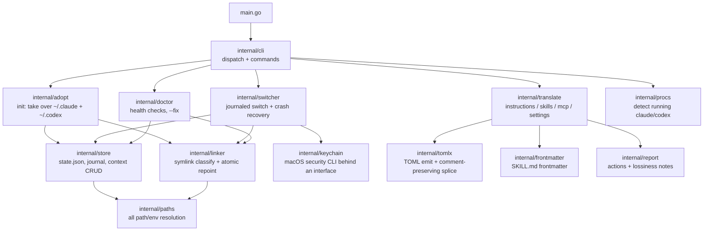

# claudectx

[](https://github.com/tlrmchlsmth/claudectx/actions/workflows/ci.yml)

**kubectx for your AI coding agents.** Switch between named *contexts* — bundled
Claude Code + Codex CLI state (settings, auth tokens, skills, instructions,
MCP servers) — with one command. Translate configuration between the two tools.

```console
$ claudectx create client-x
$ claudectx client-x
Switched to "client-x" (claude ✓ codex ✓ keychain ✓)
$ claudectx -            # back to the previous context
$ claudectx
* default
  client-x
```

## Install

```sh
go install github.com/tlrmchlsmth/claudectx@latest   # or: just install
```

Then adopt your existing state:

```sh
claudectx init
```

`init` moves `~/.claude` and `~/.codex` into `~/.claudectx/contexts/default/`
and symlinks them back. Nothing is deleted; `~/.claude.json` is backed up to
`~/.claudectx/backups/` first. If either path is already a symlink you manage
yourself (e.g. into dotfiles), claudectx refuses to touch it and tells you why.

## Terminal-scoped contexts

Global switching changes every terminal at once (it's a symlink). To pin just
**one terminal** to a context, use env pinning — both tools natively honor
`CLAUDE_CONFIG_DIR` / `CODEX_HOME`:

```sh
eval "$(claudectx env work)"     # this terminal now uses "work"
claudectx shell work             # or: a subshell pinned to "work" (exit to leave)
eval "$(claudectx env --unset)"  # follow the global context again
```

Add `eval "$(claudectx shell-init)"` to your shell rc for the short form:

```sh
cx work    # pin this terminal
cx off     # unpin
cx         # list
```

`claudectx current` and `list` are pin-aware. One caveat: the macOS Keychain
is per-user, not per-terminal, so env-pinned terminals share whichever Claude
login is globally active — pinning isolates settings, skills, MCP servers,
and history, not the OAuth token. (Codex `auth.json` *is* per-context even
when pinned.) Avoid running global switches while a pinned terminal actively
uses the same context — both write the same `.claude.json`.

## How it works

```
~/.claude        -> ~/.claudectx/contexts/<current>/claude     (symlink)
~/.codex         -> ~/.claudectx/contexts/<current>/codex      (symlink)
~/.claude.json   <- copy-swapped on every switch with the context's
                    claude/.claude.json (not symlinked: Claude Code rewrites
                    it with rename(2), which would destroy a symlink)
```

The context copy lives at `contexts/<name>/claude/.claude.json` — exactly
where Claude Code itself writes it under `CLAUDE_CONFIG_DIR`, so global mode
and terminal pinning share one canonical file.

Switching atomically repoints both symlinks and copy-swaps `~/.claude.json`
(MCP servers, per-project state).

### Crash recovery

Every multi-step operation writes a journal entry to
`~/.claudectx/state.json` before each step. If a switch dies halfway —
power loss, ^C, a failing `security` call — the **next claudectx command of
any kind** notices the journal and rolls the operation *forward* to its
target before doing anything else. Steps are ordered so this is always safe:

1. capture the outgoing context's token and `claude.json` (nothing moved yet —
   a failure here aborts cleanly),
2. repoint the symlinks (the commit point),
3. install the incoming context's `claude.json` and token (pure replays —
   they only read already-captured state).

Recovery reconciles by looking at where the links actually point, not by
trusting what the journal says happened, so even a crash *during recovery*
converges. `claudectx doctor` shows any pending journal.

### Tokens

Each context carries its own logins:

- **Codex**: `auth.json` (a ChatGPT login *or* your `OPENAI_API_KEY`) lives
  inside the symlinked dir — travels with the context automatically. Use
  `codex login --api-key` so the key lands on disk; a key set only via the
  `OPENAI_API_KEY` shell variable is not context-scoped.
- **Claude Code (macOS)**: the OAuth token lives in the Keychain. On switch,
  claudectx stashes it into the outgoing context
  (`contexts/<name>/secrets/`, mode 0600) and restores the incoming context's
  token. A context with no stored login gets the keychain item *deleted*, so
  tokens never leak between contexts; just run `claude` and log in once.
- **Claude Code (Linux)**: `~/.claude/.credentials.json` travels with the dir.

Disable keychain handling with `CLAUDECTX_NO_KEYCHAIN=1`.
No credential — the Keychain stash, Claude's `.credentials.json`, or Codex's
`auth.json` — is ever copied by `create --from`; clones start logged out so
each context holds its own key. Tokens are also never printed and never
passed as command-line arguments.

## Commands

| Command | What it does |
|---|---|
| `claudectx` | list contexts (current marked) |
| `claudectx <name>` / `claudectx -` | switch / switch to previous |
| `claudectx create <name> [--from [<ctx>]]` | new empty context; `--from <ctx>` clones one instead (never its credentials) |
| `claudectx delete <name>` | confirm, then move to `backups/` (never `rm -rf`) |
| `claudectx rename <old> <new> [--force]` | rename (relinks if active; confirms if agents are running) |
| `eval "$(claudectx env <name>)"` / `claudectx shell <name>` | pin one terminal to a context |
| `claudectx show [name] [--json]` | settings, skills, MCP servers, token presence |
| `claudectx translate <direction>` | convert config between the tools (below) |
| `claudectx doctor [--fix]` | verify symlinks, perms, state consistency |

## Translation

```sh
claudectx translate claude-to-codex --dry-run
claudectx translate codex-to-claude --only mcp,skills
```

Directions: `claude-to-codex`, `codex-to-claude`. Operates inside a context
(default: current; `--context <name>` for any other) and prints a report of
everything that was translated, skipped, or **lost**:

| Artifact | Claude | Codex | Fidelity |
|---|---|---|---|
| Instructions | `CLAUDE.md` | `AGENTS.md` | `@file` imports are inlined (Codex has no imports; `--no-inline-imports` to keep verbatim) |
| Skills | `skills/*/SKILL.md` | `skills/*/SKILL.md` | same Agent Skills standard — copied; Claude-only frontmatter (`allowed-tools`, …) kept with a warning |
| MCP servers | `mcpServers` in `~/.claude.json` | `[mcp_servers.*]` in `config.toml` | stdio servers map 1:1; http/sse reported with a paste-ready snippet |
| Permissions | `permissions.defaultMode` | `approval_policy` + `sandbox_mode` | mode maps; allow/deny rule lists have no Codex equivalent (reported as lost with counts) |
| Models | `model` | `model` | never translated across vendors |

Existing destination files are merged, not clobbered: `config.toml` edits are
spliced around your comments and re-validated before writing; `settings.json`
/ `claude.json` merges only touch the relevant keys. Conflicts skip unless
`--force`. A symlinked `CLAUDE.md`/`AGENTS.md` destination is never overwritten.

## Environment variables

| Variable | Default | Purpose |
|---|---|---|
| `CLAUDECTX_HOME` | `~/.claudectx` | state root |
| `CLAUDECTX_CLAUDE_DIR` | `$CLAUDE_CONFIG_DIR` or `~/.claude` | managed Claude dir |
| `CLAUDECTX_CODEX_DIR` | `$CODEX_HOME` or `~/.codex` | managed Codex dir |
| `CLAUDECTX_CLAUDE_JSON` | `~/.claude.json` | copy-swapped Claude state file |
| `CLAUDECTX_NO_KEYCHAIN` | unset | disable macOS Keychain handling |

## Architecture



Layering rules: `paths` is the only package that reads environment variables;
everything receives a `Paths` value, which is what makes the whole tree
testable under a temp dir. `linker` and `store` are the primitives;
`switcher` (the correctness core — every mutation is journaled in
`state.json` and rolled forward after a crash) and `adopt` compose them;
`cli` only parses arguments and formats output. `translate` is a pure
planner: each translator returns `Action`s with attached `LossNote`s, and
nothing touches disk until the plan is applied — which is why `--dry-run`
output is exactly what a real run does.

| Package | One-liner |
|---|---|
| `cli` | argument dispatch (bare context names → `switch`), command implementations, exit codes |
| `paths` | resolves every location from env (`CLAUDECTX_*`, `CLAUDE_CONFIG_DIR`, `CODEX_HOME`), detects terminal pinning |
| `store` | `state.json` read/write, crash journal, context list/create/trash, name validation |
| `linker` | classifies `~/.claude`/`~/.codex` (real dir / managed link / foreign link / dangling) and atomically repoints symlinks |
| `switcher` | the 5-step journaled switch: stash keychain → capture claude.json → repoint links → restore claude.json → restore keychain |
| `adopt` | `init`: moves existing real dirs into the `default` context and symlinks back; refuses foreign symlinks |
| `keychain` | `Backend` interface over the macOS `security` CLI (secret via stdin, never argv) with `Null`/`Fake` implementations |
| `procs` | scans `ps` for running `claude`/`codex` so switch/rename can warn first |
| `doctor` | read-only health checks (links vs state, perms, stale journal, old codex layout) with an auto-`--fix` subset |
| `translate` | the four translators; plan-then-apply with per-artifact lossiness reporting |
| `tomlx` | minimal TOML emitter + textual section splice that preserves user comments, re-validated before write |
| `frontmatter` | tolerant SKILL.md frontmatter parse that round-trips byte-faithfully |
| `report` | shared `Action`/`LossNote` model and terminal rendering |
| `fsx` | `CopyTree` (symlink-preserving) shared by adopt/create/skills |
| `testenv` | test fixture builder: fabricates realistic `~/.claude`/`~/.codex` trees under `t.TempDir()` |

## Development

```sh
just test     # go test ./...
just lint     # go vet
just build    # bin/claudectx
```

Everything is testable against a throwaway root: the env vars above redirect
every path, and the keychain sits behind an interface with a fake.

## License

[Apache-2.0](LICENSE)
